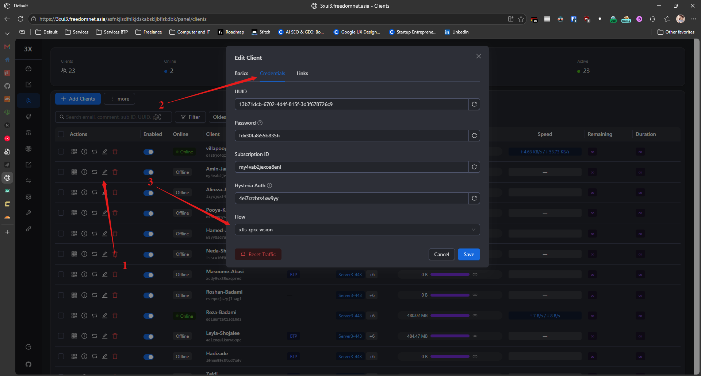
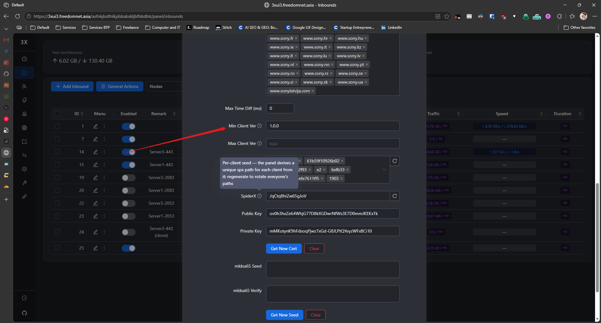

# Creating proxy guide

Deploying a 3XUI instance is self explanetory
Here are some tips on creating inbounds in the panel which connect

## Reality

It connects and it dose not need certificate note 2 things

1. Set the flow for each client reality uses xtls flow but it is not set in inbound but rather in each clients profile as shown bellow

2. For karing and other clinets which are not Xray based set the min version to 1.0.0 or they will not connect

3. Do not create reality on port 443 create it on a random port
