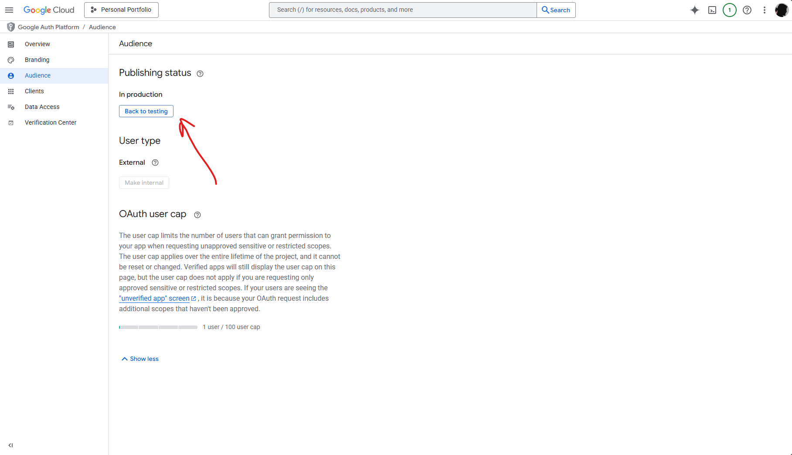
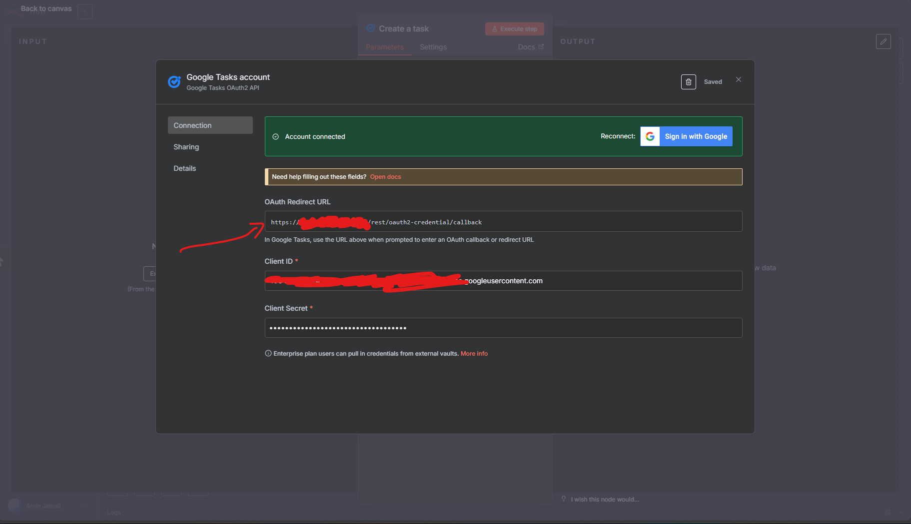

# n8n

# OAuth and redirect problem

When tying to login to google services any OAuth client you create will be assigned to test users unless you publish your app (meaning the OAuth is accessible via any Gmail)
To publish go to google cloud => API and services => OAuth concent screen => Audiance => Publishing staus => Click publish

And be sure to set N8N_EDITOR_BASE_URL enviroment variable to the address you can access your n8n instance so OAuth authentication can redirect to the correct address **this must be done since the default value for this is localhost which will not work**

