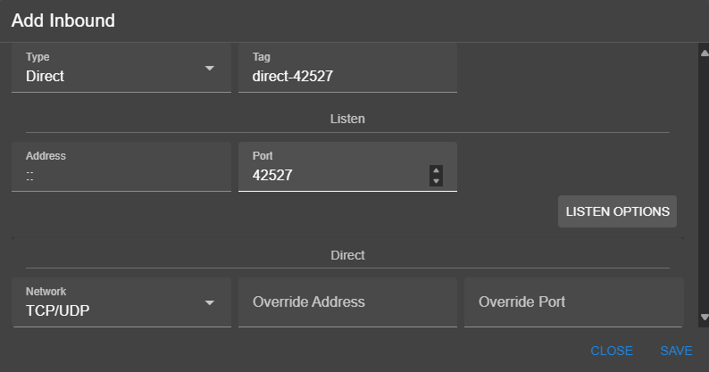

# S-UI

A UI for singbox cenorship circumvention tool this UI allows easy configuration for singbox

## Tunnel

To create a tunnel we create a DIRECT inbound this inbound will basicly forward all traffic comming to the server address and assigned port to the overide address and port

Now any traffic going to that address and port will be forwarded to the overide address so if you for example replace the vless going to ip 1.2.3.4:1234 server which is germany server and replace it by 5.6.7.8:1234 which is the server in iran which the port 1234 in iran server is a direct inbound overridng traffic to 1.2.3.4:1234 it will work if the server is not blocked

## Subscription domain and link

To prevent the users from being blocked from the subscription links that provide VPN configuraitons we need to provide a seprate domain for subscriptions from the VPN themselves and put it behind cloudflare CDN so in case VPN IP gets blocked the subscriptions them selves are accessible
